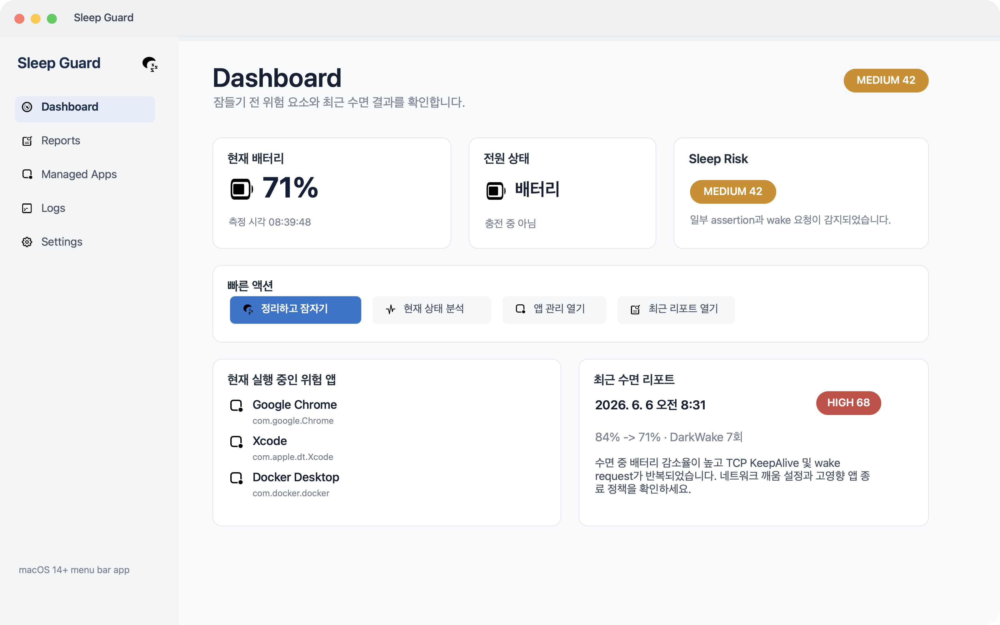
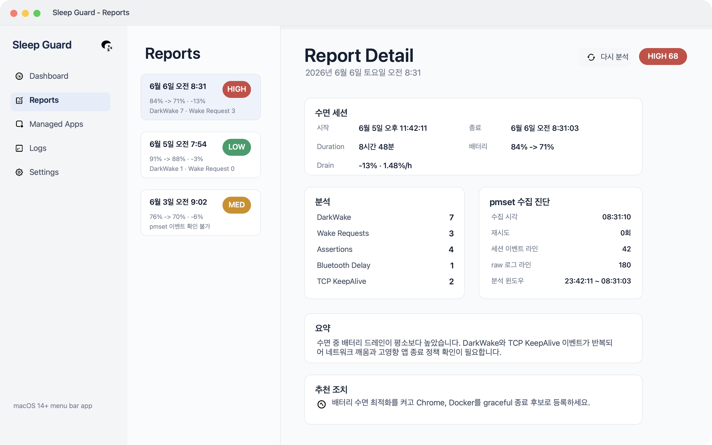
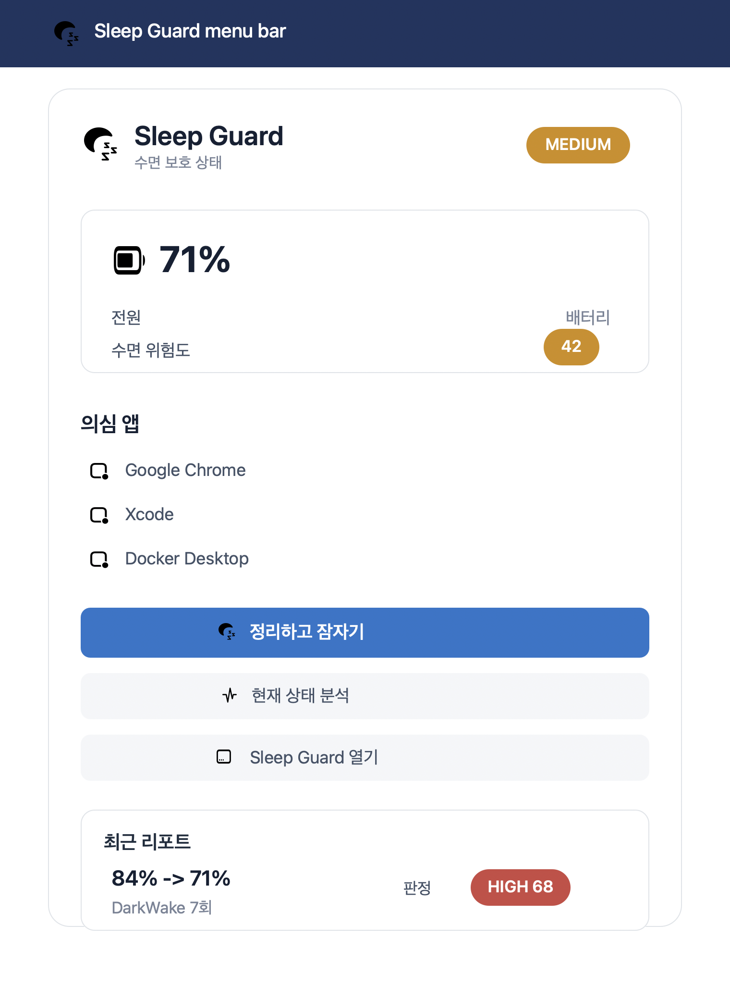
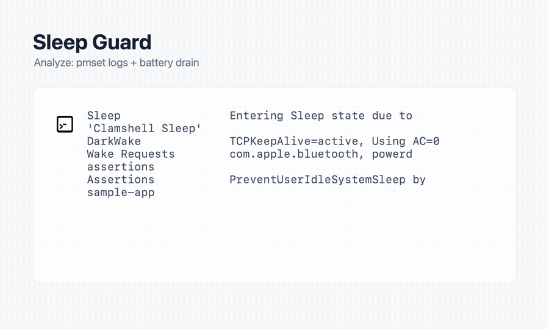

# Sleep Guard

Sleep Guard is a macOS 14+ native menu bar app for understanding and reducing battery drain while a Mac is asleep.

It records sleep/wake sessions, analyzes bounded `pmset` log windows, explains likely wake causes, and can safely quit and restore user-approved apps around sleep.

## Problem

MacBooks can lose unexpected battery overnight even when the lid is closed. The root cause is often hard to inspect because wake activity is scattered across `pmset` logs, power assertions, app behavior, and battery history.

Sleep Guard focuses on three practical questions:

- How much battery was lost during a sleep session?
- Which `pmset` events, assertions, or wake requests likely contributed?
- Which apps can be safely cleaned up before sleep without risking user data?

## Features

- **Menu bar app**: stays lightweight and available before the Mac sleeps.
- **Sleep reports**: stores sleep start, wake time, battery before/after, drain rate, risk score, summary, and recommendations.
- **`pmset` log analysis**: parses sleep/wake events, DarkWake, wake requests, assertions, Bluetooth delay, TCP keepalive, and diagnostics.
- **Safe app cleanup**: gracefully quits only enabled managed apps by default, then restores trusted local `.app` bundles after wake.
- **High-impact app detection**: can identify battery-heavy running apps while excluding higher data-loss categories from broad automatic cleanup.
- **Safety-first force termination**: force termination requires global enablement, per-app opt-in, and policy allowlist approval.
- **Settings and logs views**: review raw bounded excerpts, import JSON logs, tune cleanup limits, login item behavior, and wake report notifications.
- **Shortcuts support**: exposes a "clean and sleep" action for macOS Shortcuts.

## Screenshots

Screenshots use sample data for documentation and do not contain user logs.









## Project

- Product: `Sleep Guard`
- Bundle identifier: `com.sihun.sleepguard`
- Minimum target: macOS 14+
- Stack: Swift, SwiftUI, AppKit, SwiftData, XCTest, Swift Testing
- Xcode project: `SleepGuard/SleepGuard.xcodeproj`
- Main scheme: `SleepGuard`

## Architecture

```text
SleepGuard/SleepGuard/
├── App/              # AppDelegate, dependency container, controllers, status bar/window wiring
├── Core/             # PMSet, power events, battery, app termination/restore, analysis
├── Data/             # SwiftData models and store protocols/implementations
├── DesignSystem/     # Shared SwiftUI components
├── Features/         # Dashboard, reports, logs, managed apps, settings
└── Resources/        # JSON policy/scoring configuration
```

Controller code depends on store protocols, while SwiftData access stays behind `Data/Stores/`. PMSet command execution goes through command runner abstractions so large output can be streamed, bounded, and tested.

## Safety Model

Sleep Guard treats user data safety as more important than aggressive cleanup.

- Default termination is graceful-only.
- Apps are quit only when the user added them as managed apps and enabled pre-sleep termination.
- Browsers, IDEs/development tools, and document editors are treated as high data-loss risk.
- Force termination is disabled by default and requires all safety gates to pass.
- Restore is limited to trusted local `.app` bundles from approved Applications directories.
- Full `pmset -g log` output is not persisted; reports store bounded excerpts and diagnostics.

## Permissions And System Access

- Reads `/usr/bin/pmset` assertions, schedules, and sleep/wake logs.
- Calls `pmset sleepnow` only for the explicit clean-and-sleep action.
- Uses ServiceManagement for optional login item registration.
- Uses user notifications for wake report alerts.
- Uses `NSWorkspace` to restore trusted local app bundles.
- Does not send logs, app lists, or reports over the network.

## Build

```sh
xcodebuild -project SleepGuard/SleepGuard.xcodeproj -scheme SleepGuard -destination 'platform=macOS' build
```

## Test

```sh
xcodebuild -project SleepGuard/SleepGuard.xcodeproj -scheme SleepGuard -destination 'platform=macOS' test
```

Run whitespace checks before committing:

```sh
git diff --check
```

## Release Artifacts

Release builds are distributed as DMG assets. Local build artifacts should stay out of git and be uploaded to GitHub Releases instead.

## Privacy

Sleep Guard stores data locally with SwiftData.

Stored data is limited to sleep session timing, battery values, report summaries, bounded `pmset` excerpts, diagnostics, and app snapshots used for safe restore. The app does not transmit this data.

## Contributing

Contributions should preserve the safety model above. Changes touching PMSet parsing, command output handling, sleep lifecycle state, app termination/restore policy, persistence, settings side effects, or report generation should include focused tests.

## License

Sleep Guard is released under the MIT License. See [LICENSE](LICENSE).
